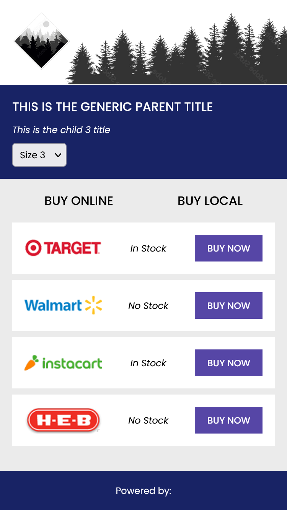

# React Online Widget

This react application is modeled after the applications I currently build for the company I work at.

## Table of Contents

- [Overview](#overview)
  - [The project](#the-project)
  - [Screenshot](#screenshot)
  - [Links](#links)
- [My Process](#my-process)
  - [Built with](#built-with)
  - [What I learned](#what-i-learned)
  - [Continued development](#continued-development)
  - [Useful resources](#useful-resources)
- [Author](#author)

## Overview

#### The project

This react app is capable of the following:

- Given a JSON object:
  - Render selected child's parent title, title and online offers
  - Dynamically render a new set of data when a new product is selected
- Fully responsive UI

#### Screenshot



#### Links

- [Deployed Application](https://lksawyer.github.io/personal/)

## My Process

#### Built with

- HTML5 markup
- CSS3
  - Flexbox
- Mobile-first workflow
- BEM
- ES6
  - Arrow functions
  - Array destructuring
  - Modern Array methods
  - Import/ Export modules
- React - JS library

#### What I learned

Here are some code snippets of core React concepts I learned/implemented into this project during development:

Implement state using array destructuring

```
 const [childProduct, setChildProduct] = useState(0);
```

Dynamically render React components using the .map arrary method

```
<div className={styles.online}>
    {props.onlineResults.children[props.childProduct].offers.map((offer) => (
    <OnlineRetailerCard
        key={offer.id}
        retailer={offer.retailer}
        stock={offer.stock}
        cta={offer.cta}
    />
    ))}
</div>
```

Component Scoped CSS using CSS modules

```
import styles from "./WidgetHeader.module.css";


```

#### Continued development

In future projects, I would like to incorporate the following React concepts:

- Optimization
- Class based components
- Routing
- Redux
- HTTPs request

## Author

Logan Sawyer - Front End Developer
